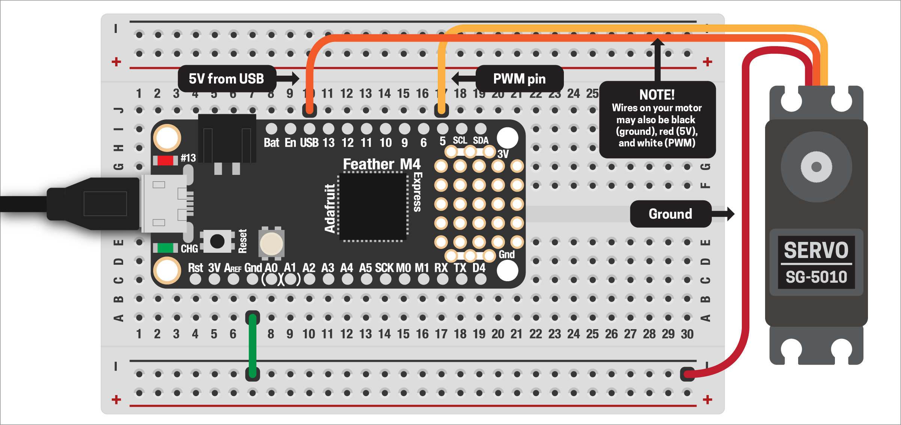

# SERVO MOTOR BASICS

There are lots of different types of motors out there: super fast and tiny DC motors in toys, 50 horsepower AC motors to run massive machines, geared motors to move your windshield wipers, bonkers battery-powered motors in drones, steppers for super-accurate CNC control... all of which have their uses. But for this project, we'll focus on servo motors, which provide a good balance. They give us accuracy and control, don't require any extra circuitry, and can be powered right from the Feather.

Inside the servo are several small parts: a fast-spinning DC motor, some gears to slow it down (either plastic or metal), some control circuitry, and a potentiometer to read the angle of the motor.


*A view inside a typical servo motor, via [How to Mechatronics](https://howtomechatronics.com/how-it-works/how-servo-motors-work-how-to-control-servos-using-arduino)*

Over the next couple of demos, we'll see how to hook up and use your servo. If you're interested in a deep-dive into servo motors and all the other types, see [this great post from Adafruit](https://learn.adafruit.com/adafruit-motor-selection-guide).

***

### CONTENTS  

* [Connecting the servo](#connecting-the-servo)  
* [Making the servo move](#making-the-servo-move)  
* [Full code example](#full-code-example)  

### STUFF YOU'LL NEED  

* "Standard" servo motor  
* Jumper wires  
* Feather board  
* USB cable  

***

### CONNECTING THE SERVO  
Unlike DC or stepper motors, servos are super easy to hook up! They don't require any additional parts, unless you want to use a bunch of them (see [`Multiple Servos`](#multiple-servos) below).

Servos all have three wires. They can vary in color, but ours are:  

* Dark red: ground  
* Red: 5V  
* Orange: control  
* White: bonus! Our servo also has a special fourth wire we'll talk about later  

The colors on your motor may vary, but the wires should always be in the same order. The only issue for us is the Feather runs on `3.3V`, not `5V`, so what are we supposed to do? Luckily, the Feather provides us access to the power coming in from the USB connection (whether connected to your computer or just a power supply). USB runs on 5V, so problem solved!

Hook up your servo to your board like this:  

  

***

### MAKING THE SERVO MOVE  
With the motor wired, let's write some code to make it move. First, we need to import a few libraries:

```python
import board
import pwmio
import time
```

The servo uses pulse width modulation (PWM) to control it, but doing that yourself would be super messy – lots of precise timing to figure out. Luckily, Adafruit has a motor library that handles all that for us. Copy the entire `adafruit_motor` folder to your board, then add:

```python
from adafruit_motor import servo
```

We need to set up a PWM pin for the motor:

```python
pin = pwmio.PWMOut(
  board.D5, 
  duty_cycle = 2**15, 
  frequency = 50
)
```

> 🙋‍♀️ What's the deal with `duty_cycle` and `frequency`? TLDR: don't worry about it! The value `2**15` is a fancy way of writing `32,768`, or two to the power of 15. Astute folks might recognize that number as 1/2 the resolution of the analog pins! This means that the pin's [duty cycle](https://en.wikipedia.org/wiki/Duty_cycle) will be 50%. A frequency of `50` means 50Hz, which is what the motors expect. We don't have to worry about (or modify) these values unless under really unusual circumstances!

Then we can connect our motor to the pin:

```python
motor = servo.Servo(
  pin,              # PWM pin the motor is connected to
  min_pulse = 300,  # Default = 1000 microseconds
  max_pulse = 2700  # Default = 2000 microseconds
)
```

With our motor connected, let's make it move! A "standard" servo like this can be given a specific angle and it will move to that position. While we technically just need the PWM pin to create our servo, we'll also specify the `min_pulse` and `max_pulse` values. This lets us adjust how the motor behaves so we get accurate anglular positions.

```python
motor.angle = 90
```

> ⚠️ Be very careful not to drive your motor too far in either direction: if you hear clicking or grinding, unplug your board immediately! This means the motor is trying to go past its maximum travel and can damage the servo, strip the little gears inside, or pull too much current from your Feather. Generally, 45–135º seems about right for our motors.

You'll notice it takes a moment for the motor to get to the correct angle. Adding a `time.sleep()` after each movement will be necessary, otherwise your motor might start behaving weirdly. We'll look at how to control the speed in the next example.

Let's try a couple of angles:  
```python
motor.angle = 45
time.sleep(1)

motor.angle = 90
time.sleep(1)

motor.angle = 135
time.sleep(1)

motor.angle = 90
time.sleep(1)
```

If your motor isn't reaching the correct angles, try adjusting the `min/max_pulse` values.

***

### FULL CODE EXAMPLE  

```python
import board, time, pwmio
from adafruit_motor import servo

# Create a PWM pin for our motor
pin = pwmio.PWMOut(
    board.D5,
    duty_cycle = 2**15,  # 1/2 the full PWM range
    frequency = 50       # Motor expects 50Hz signal
)

# Connect our motor to the PWM pin
motor = servo.Servo(
    pin,              # PWM pin the motors is connected to
    min_pulse = 300,  # Default = 1000us 
    max_pulse = 2700  # Default = 2000us
)

# Let's test the range of motion!
# If you see your motor isn't reaching the right angles,
# try adjusting the min_pulse/max_pulse variables above
motor.angle = 45
time.sleep(1)

motor.angle = 90
time.sleep(1)

motor.angle = 135
time.sleep(1)

motor.angle = 90
time.sleep(1)
```

